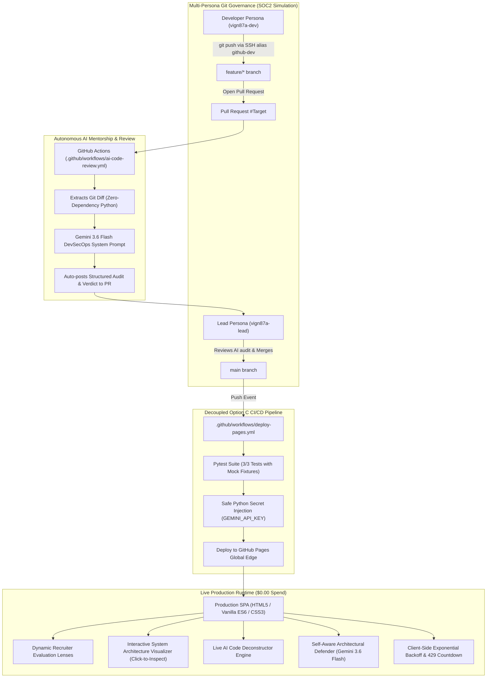

# THETRON
### Autonomous AI & Cloud Systems Engineering Platform

[](https://github.com/vign87a-git/ai-portfolio-platform/actions/workflows/deploy-pages.yml)
[](https://github.com/vign87a-git/ai-portfolio-platform/actions/workflows/ai-code-review.yml)


---

## 🌐 Live Interactive Platform
👉 **[Experience THETRON Live](https://vign87a-git.github.io/ai-portfolio-platform/)**

**THETRON** is a production-grade showcase of modern software engineering discipline, combining frontier **Agentic AI orchestration**, **zero-trust DevSecOps**, **multi-persona Git governance**, and **self-defending distributed architecture**—hosted with **\$0.00 infrastructure spend**.

---

## 🧬 Brand Identity & Genesis

| Dimension | Origin & Significance |
| :--- | :--- |
| **$\theta$ (Theta)** | Honors the mathematical breakthrough of **Srinivasa Ramanujan’s Mock Theta functions** (Tamil Nadu), foundational to modern modular forms, string theory, and quantum neural tensor spaces. |
| **-on** | The fundamental building block of computation and physical intelligence (**Neuron**, **Electron**, **NPU**). |
| **Phonetics** | `[THAY-tron]` |
| **Vision** | Signifies **Future India** as a global sovereign superpower in frontier AI and deep-tech cloud systems. Cleanly breaks the repetitive Latinate `-s/-x` naming traps, carrying zero commercial IP conflicts. |

---

## 🏛️ System Architecture Topology

The platform operates on a decoupled **Option C CI/CD architecture**, isolating public serverless hosting from containerized cloud runtime:



---

## 🔬 Core Engineering Competency Pillars

### 1. 🤖 Frontier GenAI & Agentic Systems
* **Autonomous PR Reviewer**: Production GitHub Actions workflow that extracts git diffs, analyzes architecture, flags exposed secrets, and posts structured markdown reviews with zero manual intervention.
* **Self-Aware System Context**: Embedded architectural knowledge allows Gemini 3.6 Flash to defend engineering trade-offs, discuss Git governance, and deconstruct source code in real time.
* **Dynamic Recruiter Lens**: Role-adaptive evaluation matrix tailoring interactive prompt suites and executive summaries to hiring profiles (*Cloud & DevOps*, *Agentic AI*, *Full-Stack Python*, *All-Rounder*).

### 2. 🛡️ DevSecOps & Enterprise Git Governance
* **Separation of Duties (SoD)**: Enforces corporate-grade governance between local developer persona (`vign87a-dev`) and lead reviewer persona (`vign87a-lead`) using custom SSH host aliasing.
* **Least Privilege Scoping**: Automated bots operate strictly on granular `contents: read` and `pull-requests: write` permissions.
* **In-Memory Secret Handling**: Production deployment injects API keys in CI runners via string substitution, completely preventing disk-level secret persistence.

### 3. ⚡ Modern Python & Backend APIs
* **FastAPI Backend**: Asynchronous endpoints with Pydantic payload models (`PromptPayload`) and Jinja2 server-side templating (`app/main.py`).
* **Deterministic Pytest Suite**: 100% passing tests utilizing `monkeypatch` fixtures to validate status codes, missing-key fallbacks, and mocked Gemini responses without exhausting API quotas.
* **Containerized Deployment Ready**: Multi-stage `Dockerfile` (`python:3.11-slim`) targeting port 8080, prepared for container orchestration (Cloud Run / K8s).

### 4. 📐 Distributed Resilience & FinOps Strategy
* **Automated 429 Backoff Engine**: Real-time HTTP 429 rate-limit interceptor (`fetchWithRetry`) that parses cooldown timestamps and presents a live countdown timer before retrying.
* **Permanent $0.00 Infrastructure Invariant**:
  - Free global edge distribution via GitHub Pages.
  - Unlimited CI/CD execution on public GitHub repositories.
  - Gemini 3.6 Flash running on Google AI Studio Free Tier (unlinked from GCP billing).

---

## 📂 Repository Structure

```text
ai-portfolio-platform/
├── .github/
│   └── workflows/
│       ├── ai-code-review.yml      # Autonomous AI PR Reviewer Bot (Gemini 3.6 Flash)
│       ├── deploy-pages.yml        # 100% Free GitHub Pages CI/CD Deployment
│       └── deploy-gcp.yml          # Isolated GCP Cloud Run Workflow (gcp-production)
├── app/
│   ├── templates/
│   │   ├── index.html              # Jinja2 template mirror (100% parity)
│   │   └── favicon.svg             # Cybernetic vector favicon
│   └── main.py                     # FastAPI application & GenAI routing
├── public/
│   ├── favicon.svg                 # Scalable cybernetic SVG favicon
│   └── index.html                  # Standalone SPA for GitHub Pages hosting
├── tests/
│   └── test_main.py                # Pytest suite with mock client fixtures
├── Dockerfile                      # Container specification for Cloud Run / K8s
├── requirements.txt                # Python dependencies (FastAPI, google-genai, pytest)
└── README.md                       # Architecture specification & documentation
```

---

## 🛠️ Local Quickstart & Verification

### 1. Clone & Setup
```bash
git clone git@github-dev:vign87a-git/ai-portfolio-platform.git
cd ai-portfolio-platform
```

### 2. Virtual Environment & Dependencies
```powershell
# Create and activate virtual environment
python -m venv venv
.\venv\Scripts\Activate.ps1

# Install dependencies
pip install -r requirements.txt
```

### 3. Run Automated Unit Tests
```powershell
# Execute Pytest suite
python -m pytest tests/ -v
```
Expected output:
```text
tests/test_main.py::test_read_root PASSED                [ 33%]
tests/test_main.py::test_generate_missing_api_key PASSED [ 66%]
tests/test_main.py::test_generate_content_success PASSED [100%]
======================== 3 passed in 1.25s ========================
```

### 4. Run FastAPI Server Locally
```powershell
# Set local Gemini API key
$env:GEMINI_API_KEY = "your-api-key-here"

# Launch ASGI server
uvicorn app.main:app --reload --port 8000
```
Visit `http://localhost:8000` to interact with the local FastAPI-backed instance.

### 5. Build and Run Container (Docker)
```bash
# Build container image
docker build -t thetron:latest .

# Run containerized instance
docker run -p 8080:8080 -e GEMINI_API_KEY="your-api-key" thetron:latest
```

---

## 📜 Audit & Quality Scorecard

In the formal **Enterprise Technical Audit & SWOT Analysis**, the platform achieved an overall **Grade A (9.2 / 10)**:

| Evaluation Dimension | Score | Status |
| :--- | :---: | :---: |
| **CI/CD & Automation** | `9.6 / 10` | 🟢 Superior |
| **Git Governance (SoD)** | `9.5 / 10` | 🟢 Superior |
| **Architecture & Design** | `9.2 / 10` | 🟢 Excellent |
| **Reliability & Resilience** | `8.8 / 10` | 🟢 Strong |
| **Security & Secrets** | `8.0 / 10` | 🟡 Solid / Monitored |
| **Cost Optimization** | `10.0 / 10` | 🟢 Flawless ($0.00 Spend) |

---

## ⚖️ License & Attribution
Architected and built with **THETRON Systems**. Powered by GitHub Actions and Google Gemini 3.6 Flash.
Licensed under the [MIT License](LICENSE).